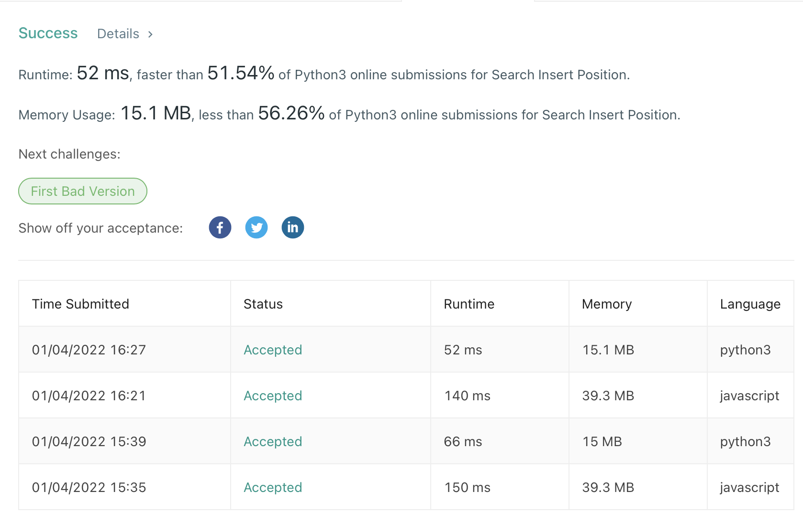

## 
Search Insert Position

#### 
📚 _LeetCode Problem #35 (**Level Easy**) 01/04/2022_ 

**_
By Daniel Adeyemi_**

---

## 
 🚩 _Description_:

##### **_This is solutions for Leet Code problem [# 35 "Search Insert Position"](https://leetcode.com/problems/search-insert-position/)._**

### 
 🤔 Problem description:

Given a sorted array of distinct integers and a target value, return the index if the target is found. If not, return the index where it would be if it were inserted in order.

You must write an algorithm with O(log n) runtime complexity.

## 
 🚥 Tests

## 
 🛠️ _Technologies used:_

- Python 3.9
- JavaScript

## 
 🌟 _Teaching points:_

- easy **O(n)** solution is looping through each element of an array until we find a target or element is bigger than it. After it found - we will return index
- for **O(log n)** solution we can use binary search since it's a sorted array.
- typical binary search approach is while loop with 2 pointers - left and right, go inside the loop and define middle and then re-assign one of the pointers depending on target and value comparacing.

## 
 📬 Contact Information

#### For any questions _[email author](mailto:adeyemidany+github@gmail.com?subject=[GitHub])_

## 
 📘 _License and copyright:_

> **_© Daniel Adeyemi, 2022_**  
> ⚖️ __
